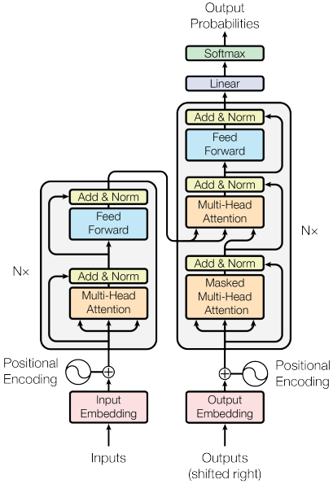

# TSAI Assignment

## SESSION 10 - Transformers Review

ASSIGNMENT

1. Train the same code, but on different data. If you have n-classes, your accuracy MUST be more than 4 \* 100 / n.
2. Submit the Github link, that includes your notebook with training logs, and proper readme file.

---

## DATASET USED

MANYTHINGS ORG DUTCH - ENGLISH DATASET

Links:

- <https://www.manythings.org/anki/>
- <https://www.manythings.org/anki/nld-eng.zip>
- [nld-eng.zip](https://github.com/arjuntheprogrammer/TSAI-END3/files/7882966/nld-eng.zip)

---

## DIAGRAMS

### Transformer

### Encoder

### Attention

### Decoder

---

## SCREENSHOTS

### TRAINING LOGS

### EVALUATION OUTPUT

### TRANSLATION OUTPUT

## REFERENCES

1. Attention is All You Need: <https://github.com/ammesatyajit/pytorch-seq2seq/blob/master/6%20-%20Attention%20is%20All%20You%20Need.ipynb>
2. Paper: Attention is All You Need <https://arxiv.org/pdf/1706.03762.pdf>
3. The Illustrated Transformer
   <https://jalammar.github.io/illustrated-transformer/>
4. What Do Position Embeddings Learn? <https://arxiv.org/pdf/2010.04903.pdf>
5. <https://github.com/bentrevett/pytorch-seq2seq/blob/master/6%20-%20Attention%20is%20All%20You%20Need.ipynb>

---
