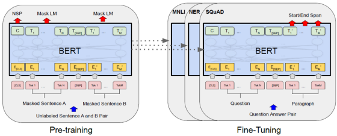
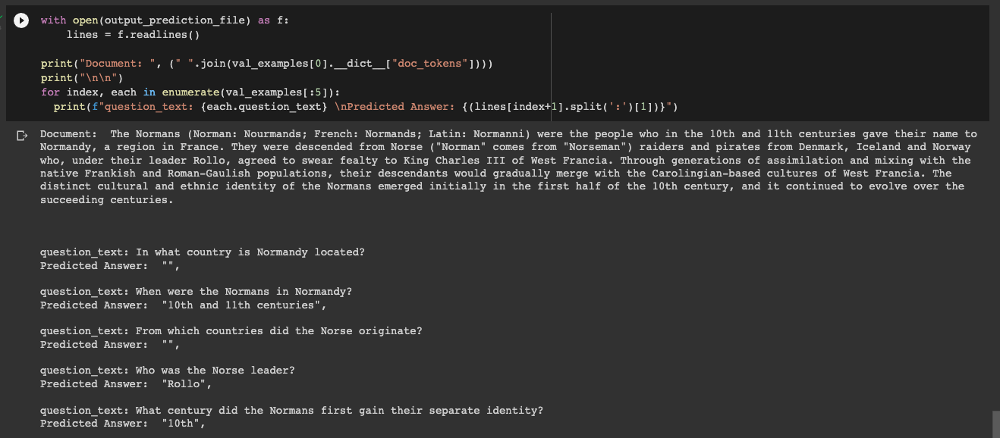
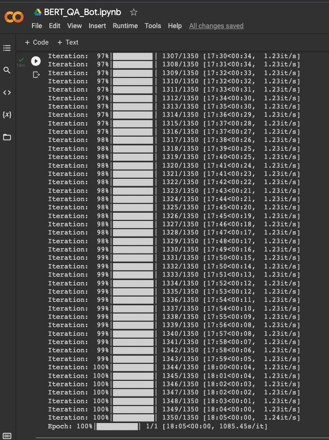
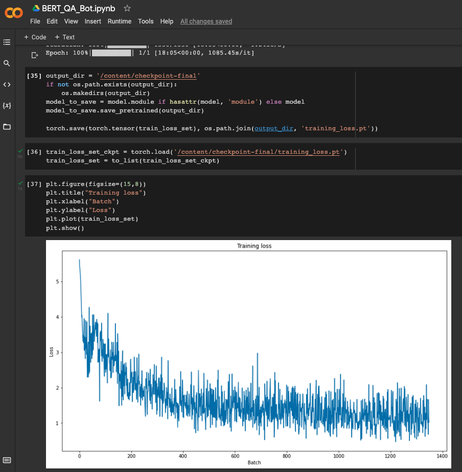
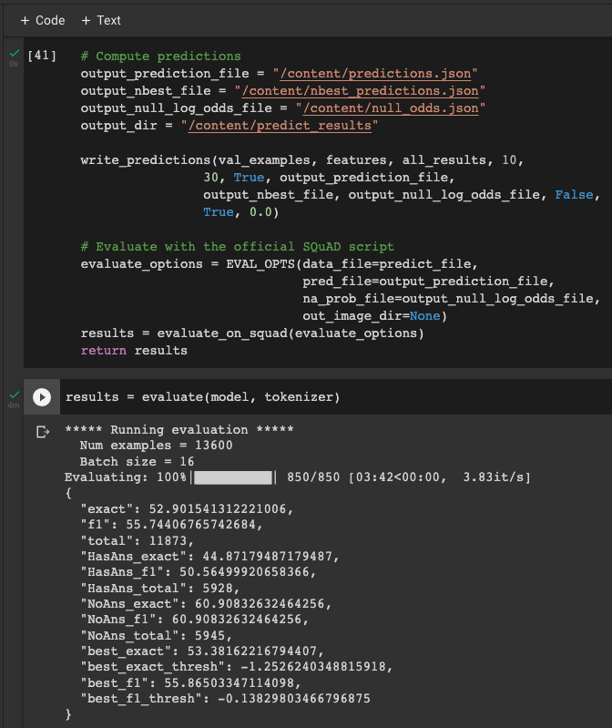

# TSAI Assignment

## SESSION 11 - TASK1 - BERT: How To Build a Question Answering Bot

Understanding the intuition with hands-on PyTorch code for BERT fine-tuned on SQuAD.

ASSIGNMENT

1. Train BERT using the code mentioned on the Squad Dataset for 20% overall samples (1/5 Epochs).
   - <https://drive.google.com/file/d/1Zp2_Uka8oGDYsSe5ELk-xz6wIX8OIkB7/view?usp=sharing>
2. Show output on 5 samples.

---

## What is BERT?

BERT (Bidirectional Encoder Representations from Transformers), released in late 2018, is the model we will use in this tutorial to provide readers with a better understanding of and practical guidance for using transfer learning models in NLP. BERT is a method of pretraining language representations that was used to create models that NLP practicioners can then download and use for free. You can either use these models to extract high quality language features from your text data, or you can fine-tune these models on a specific task (classification, entity recognition, question answering, etc.) with your own data to produce state of the art predictions.

## What is question-answering?

In Question Answering tasks, the model receives a question regarding text content and is required to mark the beginning and end of the answer in the text.

If we have a very large set of such texts together with sample questions and the position of the answers in the text, we can train a neural network to learn relationships between context, questions, and answers. The resulting network would be able to answer unseen questions given new contexts which are similar to the training texts.

## Transfer learning for question answering

The idea behind transfer learning is to take a model that was trained on a very large dataset, then fine-tune that model using the SQuAD dataset.

We can use BERT to extract high-quality language features from the SQuAD text just by adding a single linear layer on top. The linear layer has two outputs, the first for predicting the probability that the current subtoken is the start of the answer and the second output for the end position of the answer.

---

## OUTPUT ON 5 SAMPLES

---

## TRAINING LOGS

## TRAINING LOSS

## EVALUATION RESULTS

---

## DATASET USED

The Stanford Question Answering Dataset (SQuAD) is a prime example of large-scale labeled datasets for reading comprehension. Rajpurkar et al. developed SQuAD 2.0, which combines 100,000 answerable questions with 50,000 unanswerable questions about the same paragraph from a set of Wikipedia articles. The unanswerable questions were written adversarially by crowd workers to look similar to answerable ones.

<https://rajpurkar.github.io/SQuAD-explorer/>

---

## REFERENCES

1. SQUAD Data: <https://rajpurkar.github.io/SQuAD-explorer/>
2. Blog Link: <https://towardsdatascience.com/bert-nlp-how-to-build-a-question-answering-bot-98b1d1594d7b>
3. Original Colab Link: <https://drive.google.com/file/d/1Zp2_Uka8oGDYsSe5ELk-xz6wIX8OIkB7/view?usp=sharing>

---
