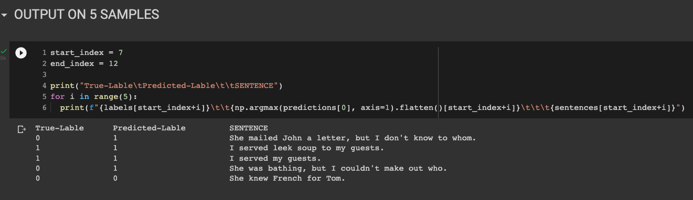
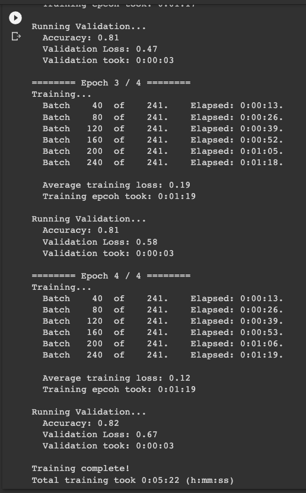
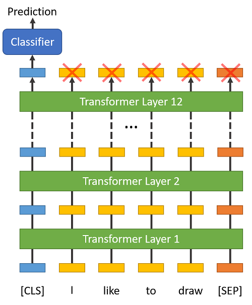
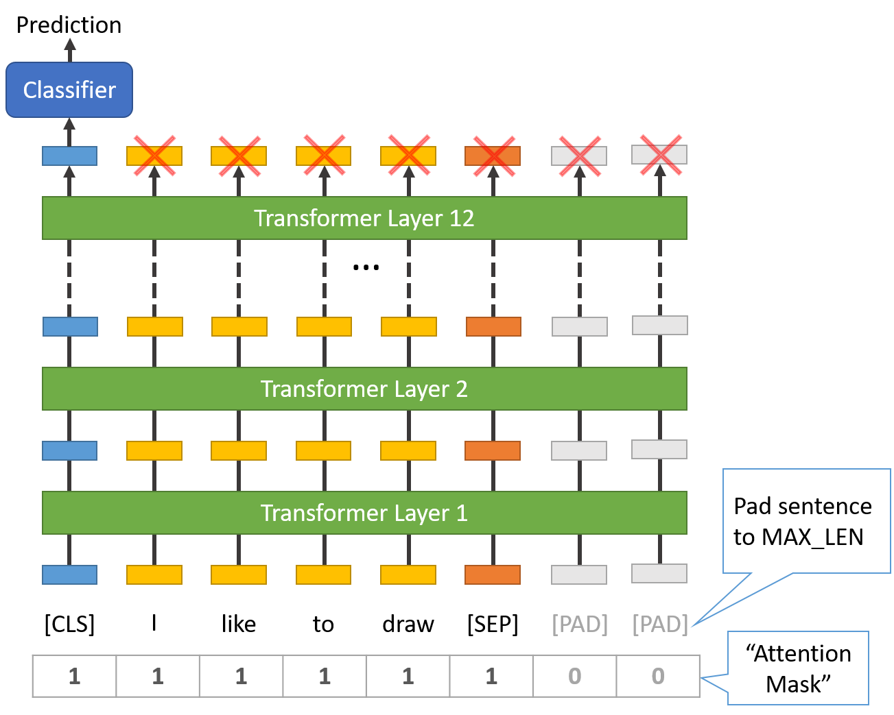

# TSAI Assignment

## SESSION 11 - TASK2 - BERT Fine-Tuning Tutorial with PyTorch

ASSIGNMENT

1. Reproductive these results
   - <https://mccormickml.com/2019/07/22/BERT-fine-tuning/>
2. Show output on 5 samples.

---

## What is BERT?

BERT (Bidirectional Encoder Representations from Transformers), released in late 2018, is the model we will use in this tutorial to provide readers with a better understanding of and practical guidance for using transfer learning models in NLP. BERT is a method of pretraining language representations that was used to create models that NLP practicioners can then download and use for free. You can either use these models to extract high quality language features from your text data, or you can fine-tune these models on a specific task (classification, entity recognition, question answering, etc.) with your own data to produce state of the art predictions.

---

## Advantages of Fine-Tuning

1. Quicker Development
2. Less Data
3. Better Results

---

## OUTPUT ON 5 SAMPLES

---

## TRAINING LOGS

---

## DIAGRAMS

Special Tokens

Sentence Length & Attention Mask

---

## DATASET USED

The Corpus of Linguistic Acceptability (CoLA) dataset
<https://nyu-mll.github.io/CoLA/>

---

## REFERENCES

1. CoLA Dataset: <https://nyu-mll.github.io/CoLA/>
2. BERT Fine-Tuning Tutorial with PyTorch
   <https://mccormickml.com/2019/07/22/BERT-fine-tuning/>
3. Colab File
   <https://colab.research.google.com/drive/1pTuQhug6Dhl9XalKB0zUGf4FIdYFlpcX>

---
