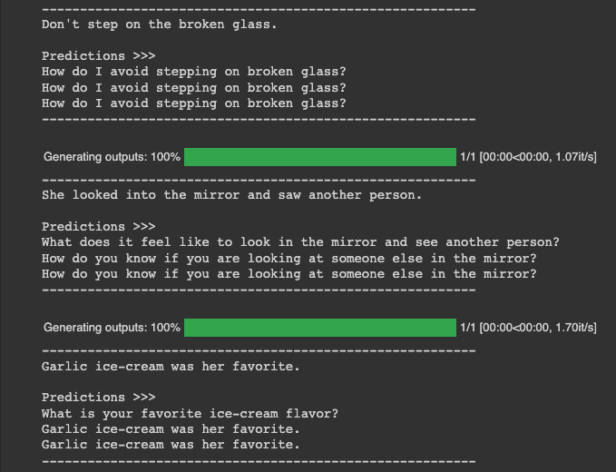
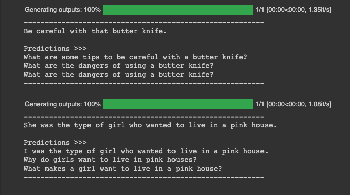
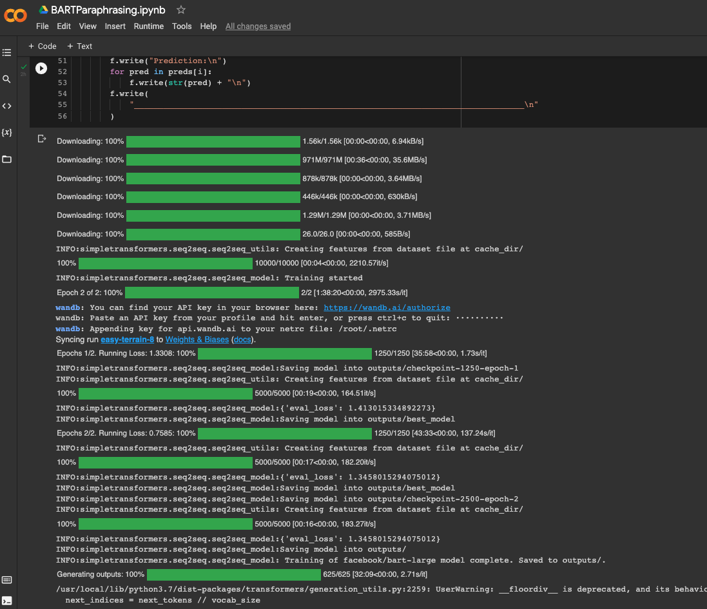
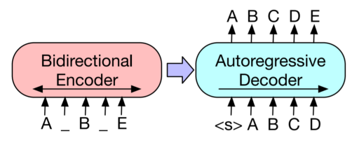

# TSAI Assignment

## SESSION 11 - TASK3 - BART for Paraphrasing with Simple Transformers

ASSIGNMENT

1. Reproduce the training explained in this blog. You can decide to pick fewer datasets.
   - <https://towardsdatascience.com/bart-for-paraphrasing-with-simple-transformers-7c9ea3dfdd8c>
2. Show output on 5 samples.

---

## What is BART?

BART is a denoising autoencoder for pretraining sequence-to-sequence models.
It is trained by

1. corrupting text with an arbitrary noising function, and
2. learning a model to reconstruct the original text.

According to the paper:

- Bart uses a standard seq2seq/machine translation architecture with a bidirectional encoder (like BERT) and a left-to-right decoder (like GPT).
- The pretraining task involves randomly shuffling the order of the original sentences and a novel in-filling scheme, where spans of text are replaced with a single mask token.
- BART is particularly effective when fine tuned for text generation but also works well for comprehension tasks. It matches the performance of RoBERTa with comparable training resources on GLUE and SQuAD, achieves new state-of-the-art results on a range of abstractive dialogue, question answering, and summarization tasks, with gains of up to 6 ROUGE.-

## What is Paraphrasing?

- Paraphrasing is the act of expressing something using different words while retaining the original meaning.
- We can do it with BART, a Sequence-to-Sequence Transformer Model.
- The pre-trained BART model can be fine-tuned directly using the input sequence (original phrase) and the target sequence (paraphrased sentence) as a Sequence-to-Sequence model.

---

## OUTPUT ON 5 SAMPLES

---

## TRAINING LOGS

---

## BART Sequence-to-Sequence

The encoder uses a denoising objective similar to BERT while the decoder attempts to reproduce the original sequence (autoencoder), token by token, using the previous (uncorrupted) tokens and the output from the encoder.

---

## DATASETS USED

- PAWS: Paraphrase Adversaries from Word Scrambling <https://github.com/google-research-datasets/paws#paws-wiki>
- First Quora Dataset Release: Question Pairs <https://quoradata.quora.com/First-Quora-Dataset-Release-Question-Pairs>
- Microsoft Research Paraphrase Corpus
  <https://msropendata.com/datasets/e235323f-f23c-4246-b2e6-27d7a654d6cc>
  - NOT USED

## REFERENCES

1. BART for Paraphrasing with Simple Transformers: <https://towardsdatascience.com/bart-for-paraphrasing-with-simple-transformers-7c9ea3dfdd8c>
2. BART: Denoising Sequence-to-Sequence Pre-training for Natural Language Generation, Translation, and Comprehension <https://arxiv.org/pdf/1910.13461.pdf>

---
