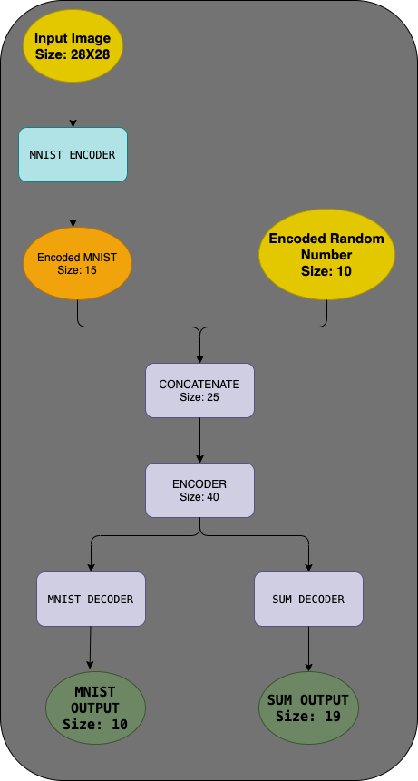
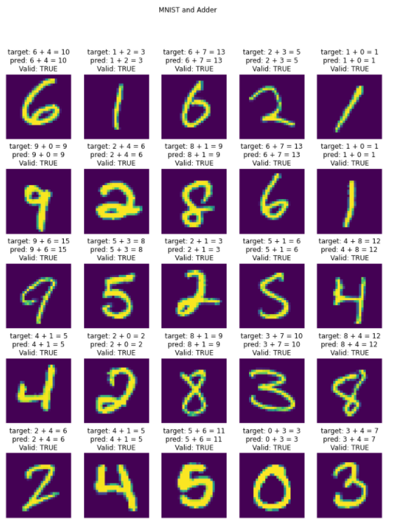

# TSAI Assignment

## Session 2.5 - PyTorch 101

1. Write a neural network that
   a. can take 2 inputs:

   1. an image from the MNIST dataset (say 5), and
   2. a random number between 0 and 9, (say 7)

   b. and gives 2 outputs:

   1. the "number" that was represented by the MNIST image (predict 5), and
   2. the "sum" of this number with the random number and the input image to the network (predict 5 + 7 = 12)

2. You can mix fully connected layers and convolution layers

3. You can use one-hot encoding to represent the random umber input as well as the "summed" output.

4. **Your code MUST be** - well documented (via readme file on github and comments in the code) - must mention the data representation - must mention your data generation strategy (basically the class/method you are using for random number generation) - must mention how you have combined the two inputs (basically which layer you are combining) - must mention how you are evaluating your results - must mention "what" results you finally got and how did you evaluate your results - must mention what loss function you picked and why!

5. Training MUST happen on the GPU

6. Accuracy is not really important for the SUM

7. Once done, upload the code with short trining logs in the readme file from colab to GitHub, and share the GitHub lik (public repository

---

## MODEL ARCHITECTURE

---

### DATA REPRESENTATION

`INPUT`:

- The input image is a tensor of size 1X28x28
  - Input Channels: 1
  - Image Size: 28X28
- The digit to be added is encoded as a one hot vector of size 10(1-D) to allow representation of digits from 0 to 9 (10 digits)

`OUTPUT`:

- The output of the MNIST predictor is 10(1-D) (to predict digits 0 to 9)
- The output of the ADDER predictor is 19(1-D) (to predict addition result from 0 to 18)

---

### DATA GENERATION STRATEGY

- MNIST Image Data is retrieved from `torchvision.datasets import MNIST`
- `np.random.randint` is used to generate the random digits which is then encoded(using one hot encoding) and for the input.

- MNIST Output again is again retrieved from `torchvision.datasets import MNIST`
- And the sum of MNIST label and Random Integer is taken and encoded(using one hot encoding)
- `CustomDataset Class` is designed to handle input and output data generation. Code Snippet:

      def **getitem**(self, index):
         img, target = super().**getitem**(index)

         rand_number = np.random.randint(low=0, high=10)
         encoded_rand_number = F.one_hot(torch.tensor(rand_number),
                                          num_classes=10)

         encoded_sum = F.one_hot(torch.tensor(target + rand_number),
                                 num_classes=29)

         if not isinstance(img, (torch.Tensor, np.ndarray)):
            img = np.array(img)

         return ((img, encoded_rand_number), (target, encoded_sum))

---

### COMBINATION OF TWO INPUTS

- First, MNIST Images are encoded using the Network(using `mnist_encoder`), resulting in output of size 15(1-D).
- Then, the encoded MNIST output is concatenated with one-hot encoded input random integer, resulting in output of size 25(1-D).
- The output is then given as input to the other encoder for generation of final outputs.
- Code Snippet from `CustomNetwork Class`:

      def forward(self, img, encoded_rand_number):
         x = self.mnist_encoder(img)
         x = torch.cat([x, encoded_rand_number], -1)
         x = self.encoder(x)

         mnist_out = self.mnist_decode(x)
         sum_out = self.sum_decode(x)
         return mnist_out, sum_out

---

### FINAL RESULTS

Our Network generates two output:

- MNIST Prediction(size: 10) and
- Sum of given inputs(size: 19).
- Code Snippet:

        (img, encoded_rand_number), (target, encoded_sum) = valid_batch

        # Get Predicted Output
        mnist_pred, sum_pred = self.forward(img, encoded_rand_number)

---

### RESULTS EVALUATION

- Both output are passed through `log_softmax` and then `torch.argmax` to give out most probable target labels.
- We then use `torchmetrics.Accuracy()` for getting accuracy for MNIST and SUM prediction.
- Class Name: `CustomNetwork`. Code Snippet:

      decoded_mnist_pred = torch.argmax(F.log_softmax(mnist_pred, dim=1), dim=1)
      decoded_sum_pred = torch.argmax(F.log_softmax(sum_pred, dim=1), dim=1)

      self.val_mnist_accuracy(decoded_mnist_pred, target)
      self.val_sum_accuracy(decoded_sum_pred, decoded_sum)

---

### WHICH LOSS FUNCTION AND WHY?

- `CrossEntropyLoss` Loss function is used.
  
- Cross Entropy is definitely a good loss function for Classification Problems, because it minimizes the distance between two probability distributions - predicted and actual.

- Class Name: `CustomNetwork`. Code Snippet 1:

      def __init__():
         ...
         self.loss_fn = nn.CrossEntropyLoss()

- Class Name: `CustomNetwork`. Code Snippet 2:

      def training_step():
         ...
         mnist_loss = self.loss_fn(mnist_pred, target)
         sum_loss = self.loss_fn(sum_pred, decoded_sum)
         loss = mnist_loss + sum_loss

---

### TRAINING LOGS

---

## NETWORK OUTPUT

---
