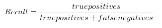
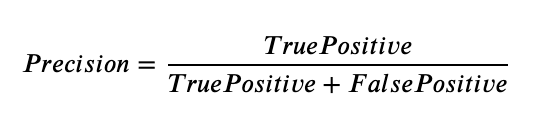
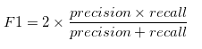
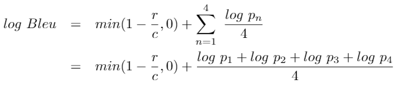
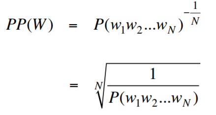

# TSAI Assignment

## SESSION 6 - Learning Rates and Evaluation Metrics - Part 1

ASSIGNMENT

Pick any of your past code and:

1. Implement the following metrics (either on separate models or same, your choice):
   1. Recall, Precision, and F1 Score
   2. BLEU
   3. Perplexity (explain whether you are using bigram, trigram, or something else, what does your PPL score represent?)
   4. BERTScore (here are 1 (Links to an external site.) 2 (Links to an external site.) examples)
2. Once done, proceed to answer questions in the Assignment-Submission Page.
   1. Share the link to the readme file where you have explained all 4 metrics.
   2. Share the link(s) where we can find the code and training logs for all of your 4 metrics
   3. Share the last 2-3 epochs/stage logs for all of your 4 metrics separately (A, B, C, D) and describe your understanding of the numbers you're seeing, are they good/bad? Why?

---

## Recall

- Recall is a metric that quantifies the number of correct positive predictions made out of all positive predictions that could have been made.
- A measure of the ability of a system to present only relevant items.
- Recall helps when the cost of false negatives is high.
- For instance, in fraud detection or sick patient detection.
  - If a fraudulent transaction (Actual Positive) is predicted as non-fraudulent (Predicted Negative), the consequence can be very bad for the bank.
  - In sick patient detection, if a sick patient (Actual Positive) goes through the test and predicted as not sick (Predicted Negative). The cost associated with False Negative will be extremely high if the sickness is contagious.

      OUR MODEL'S RECALL = 0.278

---

## Precision

- Quantifies the number of correct positive predictions made.
- Calculates the accuracy for the minority class
- Precision is a good measure to determine, when the costs of False Positive is high. For instance, email spam detection.
  - In email spam detection, a false positive means that an email that is non-spam (actual negative) has been identified as spam (predicted spam).

      OUR MODEL'S PRECISION = 0.5

---

## F1 Score

- F1 which is a function of Precision and Recall.
- F1 Score might be a better measure to use if we need to seek a balance between Precision and Recall AND there is an uneven class distribution (large number of Actual Negatives).

      OUR MODEL'S F1 SCORE = 0.357

---

## BLEU

- BLEU (bilingual evaluation understudy) is an algorithm for evaluating the quality of text which has been machine-translated from one natural language to another.
- Quality is considered to be the correspondence between a machine's output and that of a human: "the closer a machine translation is to a professional human translation, the better it is" – this is the central idea behind BLEU.
- Scores are calculated for individual translated segments—generally sentences—by comparing them with a set of good quality reference translations. Those scores are then averaged over the whole corpus to reach an estimate of the translation's overall quality.
- Intelligibility or grammatical correctness are not taken into account. BLEU's output is always a number between 0 and 1. This value indicates how similar the candidate text is to the reference texts, with values closer to 1 representing more similar texts. Few human translations will attain a score of 1, since this would indicate that the candidate is identical to one of the reference translations. For this reason, it is not necessary to attain a score of 1.
- Because there are more opportunities to match, adding additional reference translations will increase the BLEU score.

      OUR MODEL'S BLEU SCORE = 0.711

## Perplexity

- Perplexity is a measurement of how well a probability model predicts a sample. In the context of Natural Language Processing, perplexity is one way to evaluate language models.

- Less entropy (or less disordered system) is favorable over more entropy. Because predictable results are preferred over randomness. This is why people say low perplexity is good and high perplexity is bad since the perplexity is the exponentiation of the entropy (and you can safely think of the concept of perplexity as entropy).

      OUR MODEL'S PPL SCORE = 6.772

---

## BERTScore

- BERTScore leverages the pre-trained contextual embeddings from BERT and matches words in candidate and reference sentences by cosine similarity.
- It has been shown to correlate with human judgment on sentence-level and system-level evaluation.
- BERTScore computes precision, recall, and F1 measure, which can be useful for evaluating different language generation tasks.

      OUR MODEL'S BERTS SCORE = 0.828

---

## REFERENCES

1. <https://pytorch.org/tutorials/intermediate/seq2seq_translation_tutorial.html>
2. <https://scikit-learn.org/stable/modules/generated/sklearn.metrics.precision_recall_fscore_support.html>
3. <https://pytorch.org/text/stable/data_metrics.html>
4. <https://github.com/Tiiiger/bert_score>
5. <https://torchmetrics.readthedocs.io/en/latest/references/modules.html?highlight=BERTScore#bertscore>
6. <https://torchmetrics.readthedocs.io/en/latest/references/modules.html#text>
7. <https://towardsdatascience.com/machine-translation-evaluation-with-sacrebleu-and-bertscore-d7fdb0c47eb3>
8. <https://colab.research.google.com/drive/1kpL8Y_AnUUiCxFjhxSrxCsc6-sDMNb_Q#scrollTo=Bu2lZchuMjzP>
9. <https://colab.research.google.com/drive/1kpL8Y_AnUUiCxFjhxSrxCsc6-sDMNb_Q>
10. <https://huggingface.co/metrics/bertscore>
11. <https://huggingface.co/docs/transformers/perplexity>

---
